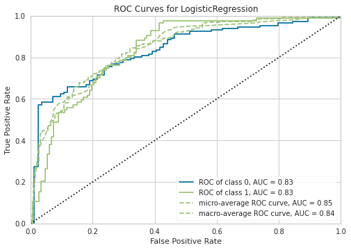

```python
# This Python 3 environment comes with many helpful analytics libraries installed
# It is defined by the kaggle/python Docker image: https://github.com/kaggle/docker-python
# For example, here's several helpful packages to load

import numpy as np # linear algebra
import pandas as pd # data processing, CSV file I/O (e.g. pd.read_csv)

# Input data files are available in the read-only "../input/" directory
# For example, running this (by clicking run or pressing Shift+Enter) will list all files under the input directory

import os
for dirname, _, filenames in os.walk('/kaggle/input'):
    for filename in filenames:
        print(os.path.join(dirname, filename))

# You can write up to 20GB to the current directory (/kaggle/working/) that gets preserved as output when you create a version using "Save & Run All" 
# You can also write temporary files to /kaggle/temp/, but they won't be saved outside of the current session
```

    /kaggle/input/tabular-playground-series-apr-2022/sample_submission.csv
    /kaggle/input/tabular-playground-series-apr-2022/train_labels.csv
    /kaggle/input/tabular-playground-series-apr-2022/train.csv
    /kaggle/input/tabular-playground-series-apr-2022/test.csv


# PyCaret 설치
- Kaggle에서 PyCaret을 설치해본다. 


```python
!pip install numpy==1.19.5
!pip install matplotlib==3.4.0
!pip install scikit-learn==0.23.2
!pip install pycaret==2.3.5
```

    Collecting numpy==1.19.5
      Downloading numpy-1.19.5-cp37-cp37m-manylinux2010_x86_64.whl (14.8 MB)
         ━━━━━━━━━━━━━━━━━━━━━━━━━━━━━━━━━━━━━━━━ 14.8/14.8 MB 33.0 MB/s eta 0:00:00
    [?25hInstalling collected packages: numpy
      Attempting uninstall: numpy
        Found existing installation: numpy 1.21.5
        Uninstalling numpy-1.21.5:
          Successfully uninstalled numpy-1.21.5
    ERROR: pip's dependency resolver does not currently take into account all the packages that are installed. This behaviour is the source of the following dependency conflicts.
    tensorflow-io 0.21.0 requires tensorflow-io-gcs-filesystem==0.21.0, which is not installed.
    beatrix-jupyterlab 3.1.7 requires google-cloud-bigquery-storage, which is not installed.
    thinc 8.0.15 requires typing-extensions<4.0.0.0,>=3.7.4.1; python_version < "3.8", but you have typing-extensions 4.1.1 which is incompatible.
    tfx-bsl 1.7.0 requires pyarrow<6,>=1, but you have pyarrow 7.0.0 which is incompatible.
    tfx-bsl 1.7.0 requires tensorflow!=2.0.*,!=2.1.*,!=2.2.*,!=2.3.*,!=2.4.*,!=2.5.*,!=2.6.*,!=2.7.*,<3,>=1.15.5, but you have tensorflow 2.6.3 which is incompatible.
    tensorflow 2.6.3 requires absl-py~=0.10, but you have absl-py 1.0.0 which is incompatible.
    tensorflow 2.6.3 requires six~=1.15.0, but you have six 1.16.0 which is incompatible.
    tensorflow 2.6.3 requires typing-extensions<3.11,>=3.7, but you have typing-extensions 4.1.1 which is incompatible.
    tensorflow 2.6.3 requires wrapt~=1.12.1, but you have wrapt 1.14.0 which is incompatible.
    tensorflow-transform 1.7.0 requires pyarrow<6,>=1, but you have pyarrow 7.0.0 which is incompatible.
    tensorflow-transform 1.7.0 requires tensorflow!=2.0.*,!=2.1.*,!=2.2.*,!=2.3.*,!=2.4.*,!=2.5.*,!=2.6.*,!=2.7.*,<2.9,>=1.15.5, but you have tensorflow 2.6.3 which is incompatible.
    tensorflow-serving-api 2.8.0 requires tensorflow<3,>=2.8.0, but you have tensorflow 2.6.3 which is incompatible.
    spacy 3.2.4 requires typing-extensions<4.0.0.0,>=3.7.4; python_version < "3.8", but you have typing-extensions 4.1.1 which is incompatible.
    pdpbox 0.2.1 requires matplotlib==3.1.1, but you have matplotlib 3.5.1 which is incompatible.
    imageio 2.16.1 requires numpy>=1.20.0, but you have numpy 1.19.5 which is incompatible.
    featuretools 1.8.0 requires numpy>=1.21.0, but you have numpy 1.19.5 which is incompatible.
    apache-beam 2.37.0 requires dill<0.3.2,>=0.3.1.1, but you have dill 0.3.4 which is incompatible.
    apache-beam 2.37.0 requires httplib2<0.20.0,>=0.8, but you have httplib2 0.20.4 which is incompatible.
    apache-beam 2.37.0 requires pyarrow<7.0.0,>=0.15.1, but you have pyarrow 7.0.0 which is incompatible.
    Successfully installed numpy-1.19.5
    WARNING: Running pip as the 'root' user can result in broken permissions and conflicting behaviour with the system package manager. It is recommended to use a virtual environment instead: https://pip.pypa.io/warnings/venv
    Collecting matplotlib==3.4.0
      Downloading matplotlib-3.4.0-cp37-cp37m-manylinux1_x86_64.whl (10.3 MB)
         ━━━━━━━━━━━━━━━━━━━━━━━━━━━━━━━━━━━━━━━━ 10.3/10.3 MB 21.5 MB/s eta 0:00:00
    [?25hRequirement already satisfied: pyparsing>=2.2.1 in /opt/conda/lib/python3.7/site-packages (from matplotlib==3.4.0) (3.0.7)
    Requirement already satisfied: kiwisolver>=1.0.1 in /opt/conda/lib/python3.7/site-packages (from matplotlib==3.4.0) (1.4.0)
    Requirement already satisfied: numpy>=1.16 in /opt/conda/lib/python3.7/site-packages (from matplotlib==3.4.0) (1.19.5)
    Requirement already satisfied: python-dateutil>=2.7 in /opt/conda/lib/python3.7/site-packages (from matplotlib==3.4.0) (2.8.2)
    Requirement already satisfied: cycler>=0.10 in /opt/conda/lib/python3.7/site-packages (from matplotlib==3.4.0) (0.11.0)
    Requirement already satisfied: pillow>=6.2.0 in /opt/conda/lib/python3.7/site-packages (from matplotlib==3.4.0) (9.0.1)
    Requirement already satisfied: typing-extensions in /opt/conda/lib/python3.7/site-packages (from kiwisolver>=1.0.1->matplotlib==3.4.0) (4.1.1)
    Requirement already satisfied: six>=1.5 in /opt/conda/lib/python3.7/site-packages (from python-dateutil>=2.7->matplotlib==3.4.0) (1.16.0)
    Installing collected packages: matplotlib
      Attempting uninstall: matplotlib
        Found existing installation: matplotlib 3.5.1
        Uninstalling matplotlib-3.5.1:
          Successfully uninstalled matplotlib-3.5.1
    ERROR: pip's dependency resolver does not currently take into account all the packages that are installed. This behaviour is the source of the following dependency conflicts.
    beatrix-jupyterlab 3.1.7 requires google-cloud-bigquery-storage, which is not installed.
    pdpbox 0.2.1 requires matplotlib==3.1.1, but you have matplotlib 3.4.0 which is incompatible.
    Successfully installed matplotlib-3.4.0
    WARNING: Running pip as the 'root' user can result in broken permissions and conflicting behaviour with the system package manager. It is recommended to use a virtual environment instead: https://pip.pypa.io/warnings/venv
    Collecting scikit-learn==0.23.2
      Downloading scikit_learn-0.23.2-cp37-cp37m-manylinux1_x86_64.whl (6.8 MB)
         ━━━━━━━━━━━━━━━━━━━━━━━━━━━━━━━━━━━━━━━━ 6.8/6.8 MB 14.8 MB/s eta 0:00:00
    [?25hRequirement already satisfied: scipy>=0.19.1 in /opt/conda/lib/python3.7/site-packages (from scikit-learn==0.23.2) (1.7.3)
    Requirement already satisfied: joblib>=0.11 in /opt/conda/lib/python3.7/site-packages (from scikit-learn==0.23.2) (1.0.1)
    Requirement already satisfied: numpy>=1.13.3 in /opt/conda/lib/python3.7/site-packages (from scikit-learn==0.23.2) (1.19.5)
    Requirement already satisfied: threadpoolctl>=2.0.0 in /opt/conda/lib/python3.7/site-packages (from scikit-learn==0.23.2) (3.1.0)
    Installing collected packages: scikit-learn
      Attempting uninstall: scikit-learn
        Found existing installation: scikit-learn 1.0.2
        Uninstalling scikit-learn-1.0.2:
          Successfully uninstalled scikit-learn-1.0.2
    ERROR: pip's dependency resolver does not currently take into account all the packages that are installed. This behaviour is the source of the following dependency conflicts.
    yellowbrick 1.4 requires scikit-learn>=1.0.0, but you have scikit-learn 0.23.2 which is incompatible.
    pdpbox 0.2.1 requires matplotlib==3.1.1, but you have matplotlib 3.4.0 which is incompatible.
    imbalanced-learn 0.9.0 requires scikit-learn>=1.0.1, but you have scikit-learn 0.23.2 which is incompatible.
    hypertools 0.8.0 requires scikit-learn>=0.24, but you have scikit-learn 0.23.2 which is incompatible.
    featuretools 1.8.0 requires numpy>=1.21.0, but you have numpy 1.19.5 which is incompatible.
    Successfully installed scikit-learn-0.23.2
    WARNING: Running pip as the 'root' user can result in broken permissions and conflicting behaviour with the system package manager. It is recommended to use a virtual environment instead: https://pip.pypa.io/warnings/venv
    Collecting pycaret==2.3.5
      Downloading pycaret-2.3.5-py3-none-any.whl (288 kB)
         ━━━━━━━━━━━━━━━━━━━━━━━━━━━━━━━━━━━━━━━ 288.6/288.6 KB 1.6 MB/s eta 0:00:00
    [?25hRequirement already satisfied: ipywidgets in /opt/conda/lib/python3.7/site-packages (from pycaret==2.3.5) (7.6.5)
    Requirement already satisfied: pyLDAvis in /opt/conda/lib/python3.7/site-packages (from pycaret==2.3.5) (3.2.2)
    Requirement already satisfied: pandas in /opt/conda/lib/python3.7/site-packages (from pycaret==2.3.5) (1.3.5)
    Collecting scipy<=1.5.4
      Downloading scipy-1.5.4-cp37-cp37m-manylinux1_x86_64.whl (25.9 MB)
         ━━━━━━━━━━━━━━━━━━━━━━━━━━━━━━━━━━━━━━━━ 25.9/25.9 MB 30.0 MB/s eta 0:00:00
    [?25hRequirement already satisfied: nltk in /opt/conda/lib/python3.7/site-packages (from pycaret==2.3.5) (3.2.4)
    Requirement already satisfied: IPython in /opt/conda/lib/python3.7/site-packages (from pycaret==2.3.5) (7.32.0)
    Collecting spacy<2.4.0
      Downloading spacy-2.3.7-cp37-cp37m-manylinux_2_17_x86_64.manylinux2014_x86_64.whl (10.4 MB)
         ━━━━━━━━━━━━━━━━━━━━━━━━━━━━━━━━━━━━━━━━ 10.4/10.4 MB 41.9 MB/s eta 0:00:00
    [?25hRequirement already satisfied: lightgbm>=2.3.1 in /opt/conda/lib/python3.7/site-packages (from pycaret==2.3.5) (3.3.1)
    Requirement already satisfied: yellowbrick>=1.0.1 in /opt/conda/lib/python3.7/site-packages (from pycaret==2.3.5) (1.4)
    Requirement already satisfied: textblob in /opt/conda/lib/python3.7/site-packages (from pycaret==2.3.5) (0.17.1)
    Requirement already satisfied: plotly>=4.4.1 in /opt/conda/lib/python3.7/site-packages (from pycaret==2.3.5) (5.7.0)
    Requirement already satisfied: scikit-plot in /opt/conda/lib/python3.7/site-packages (from pycaret==2.3.5) (0.3.7)
    Requirement already satisfied: umap-learn in /opt/conda/lib/python3.7/site-packages (from pycaret==2.3.5) (0.5.2)
    Collecting gensim<4.0.0
      Downloading gensim-3.8.3-cp37-cp37m-manylinux1_x86_64.whl (24.2 MB)
         ━━━━━━━━━━━━━━━━━━━━━━━━━━━━━━━━━━━━━━━━ 24.2/24.2 MB 28.5 MB/s eta 0:00:00
    [?25hRequirement already satisfied: Boruta in /opt/conda/lib/python3.7/site-packages (from pycaret==2.3.5) (0.3)
    Requirement already satisfied: matplotlib in /opt/conda/lib/python3.7/site-packages (from pycaret==2.3.5) (3.4.0)
    Requirement already satisfied: pandas-profiling>=2.8.0 in /opt/conda/lib/python3.7/site-packages (from pycaret==2.3.5) (3.1.0)
    Collecting imbalanced-learn==0.7.0
      Downloading imbalanced_learn-0.7.0-py3-none-any.whl (167 kB)
         ━━━━━━━━━━━━━━━━━━━━━━━━━━━━━━━━━━━━━━ 167.1/167.1 KB 14.8 MB/s eta 0:00:00
    [?25hCollecting mlflow
      Downloading mlflow-1.25.1-py3-none-any.whl (16.8 MB)
         ━━━━━━━━━━━━━━━━━━━━━━━━━━━━━━━━━━━━━━━━ 16.8/16.8 MB 33.2 MB/s eta 0:00:00
    [?25hCollecting pyod
      Downloading pyod-0.9.9.tar.gz (116 kB)
         ━━━━━━━━━━━━━━━━━━━━━━━━━━━━━━━━━━━━━━ 116.4/116.4 KB 10.8 MB/s eta 0:00:00
    [?25h  Preparing metadata (setup.py) ... [?25ldone
    [?25hRequirement already satisfied: kmodes>=0.10.1 in /opt/conda/lib/python3.7/site-packages (from pycaret==2.3.5) (0.12.0)
    Requirement already satisfied: wordcloud in /opt/conda/lib/python3.7/site-packages (from pycaret==2.3.5) (1.8.1)
    Requirement already satisfied: joblib in /opt/conda/lib/python3.7/site-packages (from pycaret==2.3.5) (1.0.1)
    Requirement already satisfied: numpy==1.19.5 in /opt/conda/lib/python3.7/site-packages (from pycaret==2.3.5) (1.19.5)
    Requirement already satisfied: seaborn in /opt/conda/lib/python3.7/site-packages (from pycaret==2.3.5) (0.11.2)
    Requirement already satisfied: mlxtend>=0.17.0 in /opt/conda/lib/python3.7/site-packages (from pycaret==2.3.5) (0.19.0)
    Requirement already satisfied: scikit-learn==0.23.2 in /opt/conda/lib/python3.7/site-packages (from pycaret==2.3.5) (0.23.2)
    Requirement already satisfied: cufflinks>=0.17.0 in /opt/conda/lib/python3.7/site-packages (from pycaret==2.3.5) (0.17.3)
    Requirement already satisfied: threadpoolctl>=2.0.0 in /opt/conda/lib/python3.7/site-packages (from scikit-learn==0.23.2->pycaret==2.3.5) (3.1.0)
    Requirement already satisfied: setuptools>=34.4.1 in /opt/conda/lib/python3.7/site-packages (from cufflinks>=0.17.0->pycaret==2.3.5) (59.8.0)
    Requirement already satisfied: colorlover>=0.2.1 in /opt/conda/lib/python3.7/site-packages (from cufflinks>=0.17.0->pycaret==2.3.5) (0.3.0)
    Requirement already satisfied: six>=1.9.0 in /opt/conda/lib/python3.7/site-packages (from cufflinks>=0.17.0->pycaret==2.3.5) (1.16.0)
    Requirement already satisfied: smart-open>=1.8.1 in /opt/conda/lib/python3.7/site-packages (from gensim<4.0.0->pycaret==2.3.5) (5.2.1)
    Requirement already satisfied: pickleshare in /opt/conda/lib/python3.7/site-packages (from IPython->pycaret==2.3.5) (0.7.5)
    Requirement already satisfied: backcall in /opt/conda/lib/python3.7/site-packages (from IPython->pycaret==2.3.5) (0.2.0)
    Requirement already satisfied: traitlets>=4.2 in /opt/conda/lib/python3.7/site-packages (from IPython->pycaret==2.3.5) (5.1.1)
    Requirement already satisfied: pexpect>4.3 in /opt/conda/lib/python3.7/site-packages (from IPython->pycaret==2.3.5) (4.8.0)
    Requirement already satisfied: prompt-toolkit!=3.0.0,!=3.0.1,<3.1.0,>=2.0.0 in /opt/conda/lib/python3.7/site-packages (from IPython->pycaret==2.3.5) (3.0.27)
    Requirement already satisfied: pygments in /opt/conda/lib/python3.7/site-packages (from IPython->pycaret==2.3.5) (2.11.2)
    Requirement already satisfied: jedi>=0.16 in /opt/conda/lib/python3.7/site-packages (from IPython->pycaret==2.3.5) (0.18.1)
    Requirement already satisfied: decorator in /opt/conda/lib/python3.7/site-packages (from IPython->pycaret==2.3.5) (5.1.1)
    Requirement already satisfied: matplotlib-inline in /opt/conda/lib/python3.7/site-packages (from IPython->pycaret==2.3.5) (0.1.3)
    Requirement already satisfied: ipython-genutils~=0.2.0 in /opt/conda/lib/python3.7/site-packages (from ipywidgets->pycaret==2.3.5) (0.2.0)
    Requirement already satisfied: jupyterlab-widgets>=1.0.0 in /opt/conda/lib/python3.7/site-packages (from ipywidgets->pycaret==2.3.5) (1.0.2)
    Requirement already satisfied: widgetsnbextension~=3.5.0 in /opt/conda/lib/python3.7/site-packages (from ipywidgets->pycaret==2.3.5) (3.5.2)
    Requirement already satisfied: nbformat>=4.2.0 in /opt/conda/lib/python3.7/site-packages (from ipywidgets->pycaret==2.3.5) (5.2.0)
    Requirement already satisfied: ipykernel>=4.5.1 in /opt/conda/lib/python3.7/site-packages (from ipywidgets->pycaret==2.3.5) (6.9.2)
    Requirement already satisfied: wheel in /opt/conda/lib/python3.7/site-packages (from lightgbm>=2.3.1->pycaret==2.3.5) (0.37.1)
    Requirement already satisfied: pillow>=6.2.0 in /opt/conda/lib/python3.7/site-packages (from matplotlib->pycaret==2.3.5) (9.0.1)
    Requirement already satisfied: python-dateutil>=2.7 in /opt/conda/lib/python3.7/site-packages (from matplotlib->pycaret==2.3.5) (2.8.2)
    Requirement already satisfied: kiwisolver>=1.0.1 in /opt/conda/lib/python3.7/site-packages (from matplotlib->pycaret==2.3.5) (1.4.0)
    Requirement already satisfied: pyparsing>=2.2.1 in /opt/conda/lib/python3.7/site-packages (from matplotlib->pycaret==2.3.5) (3.0.7)
    Requirement already satisfied: cycler>=0.10 in /opt/conda/lib/python3.7/site-packages (from matplotlib->pycaret==2.3.5) (0.11.0)
    Requirement already satisfied: pytz>=2017.3 in /opt/conda/lib/python3.7/site-packages (from pandas->pycaret==2.3.5) (2021.3)
    Requirement already satisfied: visions[type_image_path]==0.7.4 in /opt/conda/lib/python3.7/site-packages (from pandas-profiling>=2.8.0->pycaret==2.3.5) (0.7.4)
    Requirement already satisfied: jinja2>=2.11.1 in /opt/conda/lib/python3.7/site-packages (from pandas-profiling>=2.8.0->pycaret==2.3.5) (3.1.1)
    Requirement already satisfied: phik>=0.11.1 in /opt/conda/lib/python3.7/site-packages (from pandas-profiling>=2.8.0->pycaret==2.3.5) (0.12.0)
    Requirement already satisfied: requests>=2.24.0 in /opt/conda/lib/python3.7/site-packages (from pandas-profiling>=2.8.0->pycaret==2.3.5) (2.27.1)
    Requirement already satisfied: pydantic>=1.8.1 in /opt/conda/lib/python3.7/site-packages (from pandas-profiling>=2.8.0->pycaret==2.3.5) (1.8.2)
    Requirement already satisfied: markupsafe~=2.0.1 in /opt/conda/lib/python3.7/site-packages (from pandas-profiling>=2.8.0->pycaret==2.3.5) (2.0.1)
    Requirement already satisfied: htmlmin>=0.1.12 in /opt/conda/lib/python3.7/site-packages (from pandas-profiling>=2.8.0->pycaret==2.3.5) (0.1.12)
    Requirement already satisfied: tqdm>=4.48.2 in /opt/conda/lib/python3.7/site-packages (from pandas-profiling>=2.8.0->pycaret==2.3.5) (4.63.0)
    Requirement already satisfied: multimethod>=1.4 in /opt/conda/lib/python3.7/site-packages (from pandas-profiling>=2.8.0->pycaret==2.3.5) (1.4)
    Requirement already satisfied: PyYAML>=5.0.0 in /opt/conda/lib/python3.7/site-packages (from pandas-profiling>=2.8.0->pycaret==2.3.5) (6.0)
    Requirement already satisfied: tangled-up-in-unicode==0.1.0 in /opt/conda/lib/python3.7/site-packages (from pandas-profiling>=2.8.0->pycaret==2.3.5) (0.1.0)
    Requirement already satisfied: missingno>=0.4.2 in /opt/conda/lib/python3.7/site-packages (from pandas-profiling>=2.8.0->pycaret==2.3.5) (0.4.2)
    Requirement already satisfied: attrs>=19.3.0 in /opt/conda/lib/python3.7/site-packages (from visions[type_image_path]==0.7.4->pandas-profiling>=2.8.0->pycaret==2.3.5) (21.4.0)
    Requirement already satisfied: networkx>=2.4 in /opt/conda/lib/python3.7/site-packages (from visions[type_image_path]==0.7.4->pandas-profiling>=2.8.0->pycaret==2.3.5) (2.5)
    Requirement already satisfied: imagehash in /opt/conda/lib/python3.7/site-packages (from visions[type_image_path]==0.7.4->pandas-profiling>=2.8.0->pycaret==2.3.5) (4.2.1)
    Requirement already satisfied: tenacity>=6.2.0 in /opt/conda/lib/python3.7/site-packages (from plotly>=4.4.1->pycaret==2.3.5) (8.0.1)
    Collecting catalogue<1.1.0,>=0.0.7
      Downloading catalogue-1.0.0-py2.py3-none-any.whl (7.7 kB)
    Requirement already satisfied: wasabi<1.1.0,>=0.4.0 in /opt/conda/lib/python3.7/site-packages (from spacy<2.4.0->pycaret==2.3.5) (0.9.1)
    Collecting thinc<7.5.0,>=7.4.1
      Downloading thinc-7.4.5-cp37-cp37m-manylinux2014_x86_64.whl (1.0 MB)
         ━━━━━━━━━━━━━━━━━━━━━━━━━━━━━━━━━━━━━━━━ 1.0/1.0 MB 49.3 MB/s eta 0:00:00
    [?25hRequirement already satisfied: murmurhash<1.1.0,>=0.28.0 in /opt/conda/lib/python3.7/site-packages (from spacy<2.4.0->pycaret==2.3.5) (1.0.6)
    Requirement already satisfied: blis<0.8.0,>=0.4.0 in /opt/conda/lib/python3.7/site-packages (from spacy<2.4.0->pycaret==2.3.5) (0.7.7)
    Collecting plac<1.2.0,>=0.9.6
      Downloading plac-1.1.3-py2.py3-none-any.whl (20 kB)
    Requirement already satisfied: cymem<2.1.0,>=2.0.2 in /opt/conda/lib/python3.7/site-packages (from spacy<2.4.0->pycaret==2.3.5) (2.0.6)
    Collecting srsly<1.1.0,>=1.0.2
      Downloading srsly-1.0.5-cp37-cp37m-manylinux2014_x86_64.whl (184 kB)
         ━━━━━━━━━━━━━━━━━━━━━━━━━━━━━━━━━━━━━━ 184.3/184.3 KB 16.8 MB/s eta 0:00:00
    [?25hRequirement already satisfied: preshed<3.1.0,>=3.0.2 in /opt/conda/lib/python3.7/site-packages (from spacy<2.4.0->pycaret==2.3.5) (3.0.6)
    Collecting yellowbrick>=1.0.1
      Downloading yellowbrick-1.3.post1-py3-none-any.whl (271 kB)
         ━━━━━━━━━━━━━━━━━━━━━━━━━━━━━━━━━━━━━━ 271.4/271.4 KB 22.2 MB/s eta 0:00:00
    [?25hRequirement already satisfied: alembic in /opt/conda/lib/python3.7/site-packages (from mlflow->pycaret==2.3.5) (1.7.7)
    Requirement already satisfied: Flask in /opt/conda/lib/python3.7/site-packages (from mlflow->pycaret==2.3.5) (2.1.1)
    Collecting gunicorn
      Downloading gunicorn-20.1.0-py3-none-any.whl (79 kB)
         ━━━━━━━━━━━━━━━━━━━━━━━━━━━━━━━━━━━━━━━━ 79.5/79.5 KB 7.9 MB/s eta 0:00:00
    [?25hRequirement already satisfied: importlib-metadata!=4.7.0,>=3.7.0 in /opt/conda/lib/python3.7/site-packages (from mlflow->pycaret==2.3.5) (4.11.3)
    Collecting querystring-parser
      Downloading querystring_parser-1.2.4-py2.py3-none-any.whl (7.9 kB)
    Requirement already satisfied: docker>=4.0.0 in /opt/conda/lib/python3.7/site-packages (from mlflow->pycaret==2.3.5) (5.0.3)
    Requirement already satisfied: sqlparse>=0.3.1 in /opt/conda/lib/python3.7/site-packages (from mlflow->pycaret==2.3.5) (0.4.2)
    Requirement already satisfied: gitpython>=2.1.0 in /opt/conda/lib/python3.7/site-packages (from mlflow->pycaret==2.3.5) (3.1.27)
    Requirement already satisfied: protobuf>=3.7.0 in /opt/conda/lib/python3.7/site-packages (from mlflow->pycaret==2.3.5) (3.19.4)
    Requirement already satisfied: packaging in /opt/conda/lib/python3.7/site-packages (from mlflow->pycaret==2.3.5) (21.3)
    Requirement already satisfied: click>=7.0 in /opt/conda/lib/python3.7/site-packages (from mlflow->pycaret==2.3.5) (8.0.4)
    Collecting prometheus-flask-exporter
      Downloading prometheus_flask_exporter-0.20.1-py3-none-any.whl (18 kB)
    Requirement already satisfied: entrypoints in /opt/conda/lib/python3.7/site-packages (from mlflow->pycaret==2.3.5) (0.4)
    Collecting databricks-cli>=0.8.7
      Downloading databricks-cli-0.16.6.tar.gz (62 kB)
         ━━━━━━━━━━━━━━━━━━━━━━━━━━━━━━━━━━━━━━━━ 62.2/62.2 KB 5.8 MB/s eta 0:00:00
    [?25h  Preparing metadata (setup.py) ... [?25ldone
    [?25hRequirement already satisfied: cloudpickle in /opt/conda/lib/python3.7/site-packages (from mlflow->pycaret==2.3.5) (2.0.0)
    Requirement already satisfied: sqlalchemy in /opt/conda/lib/python3.7/site-packages (from mlflow->pycaret==2.3.5) (1.4.32)
    Requirement already satisfied: future in /opt/conda/lib/python3.7/site-packages (from pyLDAvis->pycaret==2.3.5) (0.18.2)
    Requirement already satisfied: funcy in /opt/conda/lib/python3.7/site-packages (from pyLDAvis->pycaret==2.3.5) (1.17)
    Requirement already satisfied: numexpr in /opt/conda/lib/python3.7/site-packages (from pyLDAvis->pycaret==2.3.5) (2.8.1)
    Requirement already satisfied: numba>=0.35 in /opt/conda/lib/python3.7/site-packages (from pyod->pycaret==2.3.5) (0.55.1)
    Requirement already satisfied: statsmodels in /opt/conda/lib/python3.7/site-packages (from pyod->pycaret==2.3.5) (0.13.2)
    Requirement already satisfied: pynndescent>=0.5 in /opt/conda/lib/python3.7/site-packages (from umap-learn->pycaret==2.3.5) (0.5.6)
    Requirement already satisfied: pyjwt>=1.7.0 in /opt/conda/lib/python3.7/site-packages (from databricks-cli>=0.8.7->mlflow->pycaret==2.3.5) (2.3.0)
    Requirement already satisfied: oauthlib>=3.1.0 in /opt/conda/lib/python3.7/site-packages (from databricks-cli>=0.8.7->mlflow->pycaret==2.3.5) (3.2.0)
    Requirement already satisfied: tabulate>=0.7.7 in /opt/conda/lib/python3.7/site-packages (from databricks-cli>=0.8.7->mlflow->pycaret==2.3.5) (0.8.9)
    Requirement already satisfied: websocket-client>=0.32.0 in /opt/conda/lib/python3.7/site-packages (from docker>=4.0.0->mlflow->pycaret==2.3.5) (1.3.1)
    Requirement already satisfied: typing-extensions>=3.7.4.3 in /opt/conda/lib/python3.7/site-packages (from gitpython>=2.1.0->mlflow->pycaret==2.3.5) (4.1.1)
    Requirement already satisfied: gitdb<5,>=4.0.1 in /opt/conda/lib/python3.7/site-packages (from gitpython>=2.1.0->mlflow->pycaret==2.3.5) (4.0.9)
    Requirement already satisfied: zipp>=0.5 in /opt/conda/lib/python3.7/site-packages (from importlib-metadata!=4.7.0,>=3.7.0->mlflow->pycaret==2.3.5) (3.7.0)
    Requirement already satisfied: psutil in /opt/conda/lib/python3.7/site-packages (from ipykernel>=4.5.1->ipywidgets->pycaret==2.3.5) (5.9.0)
    Requirement already satisfied: debugpy<2.0,>=1.0.0 in /opt/conda/lib/python3.7/site-packages (from ipykernel>=4.5.1->ipywidgets->pycaret==2.3.5) (1.5.1)
    Requirement already satisfied: tornado<7.0,>=4.2 in /opt/conda/lib/python3.7/site-packages (from ipykernel>=4.5.1->ipywidgets->pycaret==2.3.5) (6.1)
    Requirement already satisfied: jupyter-client<8.0 in /opt/conda/lib/python3.7/site-packages (from ipykernel>=4.5.1->ipywidgets->pycaret==2.3.5) (7.1.2)
    Requirement already satisfied: nest-asyncio in /opt/conda/lib/python3.7/site-packages (from ipykernel>=4.5.1->ipywidgets->pycaret==2.3.5) (1.5.4)
    Requirement already satisfied: parso<0.9.0,>=0.8.0 in /opt/conda/lib/python3.7/site-packages (from jedi>=0.16->IPython->pycaret==2.3.5) (0.8.3)
    Requirement already satisfied: jsonschema!=2.5.0,>=2.4 in /opt/conda/lib/python3.7/site-packages (from nbformat>=4.2.0->ipywidgets->pycaret==2.3.5) (4.4.0)
    Requirement already satisfied: jupyter-core in /opt/conda/lib/python3.7/site-packages (from nbformat>=4.2.0->ipywidgets->pycaret==2.3.5) (4.9.2)
    Requirement already satisfied: llvmlite<0.39,>=0.38.0rc1 in /opt/conda/lib/python3.7/site-packages (from numba>=0.35->pyod->pycaret==2.3.5) (0.38.0)
    Requirement already satisfied: ptyprocess>=0.5 in /opt/conda/lib/python3.7/site-packages (from pexpect>4.3->IPython->pycaret==2.3.5) (0.7.0)
    Requirement already satisfied: wcwidth in /opt/conda/lib/python3.7/site-packages (from prompt-toolkit!=3.0.0,!=3.0.1,<3.1.0,>=2.0.0->IPython->pycaret==2.3.5) (0.2.5)
    Requirement already satisfied: urllib3<1.27,>=1.21.1 in /opt/conda/lib/python3.7/site-packages (from requests>=2.24.0->pandas-profiling>=2.8.0->pycaret==2.3.5) (1.26.8)
    Requirement already satisfied: certifi>=2017.4.17 in /opt/conda/lib/python3.7/site-packages (from requests>=2.24.0->pandas-profiling>=2.8.0->pycaret==2.3.5) (2021.10.8)
    Requirement already satisfied: charset-normalizer~=2.0.0 in /opt/conda/lib/python3.7/site-packages (from requests>=2.24.0->pandas-profiling>=2.8.0->pycaret==2.3.5) (2.0.12)
    Requirement already satisfied: idna<4,>=2.5 in /opt/conda/lib/python3.7/site-packages (from requests>=2.24.0->pandas-profiling>=2.8.0->pycaret==2.3.5) (3.3)
    Requirement already satisfied: notebook>=4.4.1 in /opt/conda/lib/python3.7/site-packages (from widgetsnbextension~=3.5.0->ipywidgets->pycaret==2.3.5) (6.4.10)
    Requirement already satisfied: importlib-resources in /opt/conda/lib/python3.7/site-packages (from alembic->mlflow->pycaret==2.3.5) (5.4.0)
    Requirement already satisfied: Mako in /opt/conda/lib/python3.7/site-packages (from alembic->mlflow->pycaret==2.3.5) (1.2.0)
    Requirement already satisfied: greenlet!=0.4.17 in /opt/conda/lib/python3.7/site-packages (from sqlalchemy->mlflow->pycaret==2.3.5) (1.1.2)
    Requirement already satisfied: Werkzeug>=2.0 in /opt/conda/lib/python3.7/site-packages (from Flask->mlflow->pycaret==2.3.5) (2.0.3)
    Requirement already satisfied: itsdangerous>=2.0 in /opt/conda/lib/python3.7/site-packages (from Flask->mlflow->pycaret==2.3.5) (2.1.2)
    Requirement already satisfied: prometheus-client in /opt/conda/lib/python3.7/site-packages (from prometheus-flask-exporter->mlflow->pycaret==2.3.5) (0.13.1)
    Requirement already satisfied: patsy>=0.5.2 in /opt/conda/lib/python3.7/site-packages (from statsmodels->pyod->pycaret==2.3.5) (0.5.2)
    Requirement already satisfied: smmap<6,>=3.0.1 in /opt/conda/lib/python3.7/site-packages (from gitdb<5,>=4.0.1->gitpython>=2.1.0->mlflow->pycaret==2.3.5) (3.0.5)
    Requirement already satisfied: pyrsistent!=0.17.0,!=0.17.1,!=0.17.2,>=0.14.0 in /opt/conda/lib/python3.7/site-packages (from jsonschema!=2.5.0,>=2.4->nbformat>=4.2.0->ipywidgets->pycaret==2.3.5) (0.18.1)
    Requirement already satisfied: pyzmq>=13 in /opt/conda/lib/python3.7/site-packages (from jupyter-client<8.0->ipykernel>=4.5.1->ipywidgets->pycaret==2.3.5) (22.3.0)
    Requirement already satisfied: terminado>=0.8.3 in /opt/conda/lib/python3.7/site-packages (from notebook>=4.4.1->widgetsnbextension~=3.5.0->ipywidgets->pycaret==2.3.5) (0.13.3)
    Requirement already satisfied: argon2-cffi in /opt/conda/lib/python3.7/site-packages (from notebook>=4.4.1->widgetsnbextension~=3.5.0->ipywidgets->pycaret==2.3.5) (21.3.0)
    Requirement already satisfied: Send2Trash>=1.8.0 in /opt/conda/lib/python3.7/site-packages (from notebook>=4.4.1->widgetsnbextension~=3.5.0->ipywidgets->pycaret==2.3.5) (1.8.0)
    Requirement already satisfied: nbconvert>=5 in /opt/conda/lib/python3.7/site-packages (from notebook>=4.4.1->widgetsnbextension~=3.5.0->ipywidgets->pycaret==2.3.5) (6.5.0)
    Requirement already satisfied: PyWavelets in /opt/conda/lib/python3.7/site-packages (from imagehash->visions[type_image_path]==0.7.4->pandas-profiling>=2.8.0->pycaret==2.3.5) (1.3.0)
    Requirement already satisfied: jupyterlab-pygments in /opt/conda/lib/python3.7/site-packages (from nbconvert>=5->notebook>=4.4.1->widgetsnbextension~=3.5.0->ipywidgets->pycaret==2.3.5) (0.1.2)
    Requirement already satisfied: mistune<2,>=0.8.1 in /opt/conda/lib/python3.7/site-packages (from nbconvert>=5->notebook>=4.4.1->widgetsnbextension~=3.5.0->ipywidgets->pycaret==2.3.5) (0.8.4)
    Requirement already satisfied: nbclient>=0.5.0 in /opt/conda/lib/python3.7/site-packages (from nbconvert>=5->notebook>=4.4.1->widgetsnbextension~=3.5.0->ipywidgets->pycaret==2.3.5) (0.5.13)
    Requirement already satisfied: defusedxml in /opt/conda/lib/python3.7/site-packages (from nbconvert>=5->notebook>=4.4.1->widgetsnbextension~=3.5.0->ipywidgets->pycaret==2.3.5) (0.7.1)
    Requirement already satisfied: pandocfilters>=1.4.1 in /opt/conda/lib/python3.7/site-packages (from nbconvert>=5->notebook>=4.4.1->widgetsnbextension~=3.5.0->ipywidgets->pycaret==2.3.5) (1.5.0)
    Requirement already satisfied: bleach in /opt/conda/lib/python3.7/site-packages (from nbconvert>=5->notebook>=4.4.1->widgetsnbextension~=3.5.0->ipywidgets->pycaret==2.3.5) (4.1.0)
    Requirement already satisfied: tinycss2 in /opt/conda/lib/python3.7/site-packages (from nbconvert>=5->notebook>=4.4.1->widgetsnbextension~=3.5.0->ipywidgets->pycaret==2.3.5) (1.1.1)
    Requirement already satisfied: beautifulsoup4 in /opt/conda/lib/python3.7/site-packages (from nbconvert>=5->notebook>=4.4.1->widgetsnbextension~=3.5.0->ipywidgets->pycaret==2.3.5) (4.10.0)
    Requirement already satisfied: argon2-cffi-bindings in /opt/conda/lib/python3.7/site-packages (from argon2-cffi->notebook>=4.4.1->widgetsnbextension~=3.5.0->ipywidgets->pycaret==2.3.5) (21.2.0)
    Requirement already satisfied: cffi>=1.0.1 in /opt/conda/lib/python3.7/site-packages (from argon2-cffi-bindings->argon2-cffi->notebook>=4.4.1->widgetsnbextension~=3.5.0->ipywidgets->pycaret==2.3.5) (1.15.0)
    Requirement already satisfied: soupsieve>1.2 in /opt/conda/lib/python3.7/site-packages (from beautifulsoup4->nbconvert>=5->notebook>=4.4.1->widgetsnbextension~=3.5.0->ipywidgets->pycaret==2.3.5) (2.3.1)
    Requirement already satisfied: webencodings in /opt/conda/lib/python3.7/site-packages (from bleach->nbconvert>=5->notebook>=4.4.1->widgetsnbextension~=3.5.0->ipywidgets->pycaret==2.3.5) (0.5.1)
    Requirement already satisfied: pycparser in /opt/conda/lib/python3.7/site-packages (from cffi>=1.0.1->argon2-cffi-bindings->argon2-cffi->notebook>=4.4.1->widgetsnbextension~=3.5.0->ipywidgets->pycaret==2.3.5) (2.21)
    Building wheels for collected packages: pyod, databricks-cli
      Building wheel for pyod (setup.py) ... [?25ldone
    [?25h  Created wheel for pyod: filename=pyod-0.9.9-py3-none-any.whl size=139325 sha256=d0a36e8fd0573bc188a9e8f06c62d07c3ca5c12d5e2466310139677ba7731700
      Stored in directory: /root/.cache/pip/wheels/68/32/f0/0dc3050775e77b6661a116b70817b02b4305fa253269d6d998
      Building wheel for databricks-cli (setup.py) ... [?25ldone
    [?25h  Created wheel for databricks-cli: filename=databricks_cli-0.16.6-py3-none-any.whl size=112631 sha256=3ae75cdf238ec349a4cf775a5fd33709acb1b17e8f1c1265eb3de4fe7c88fa22
      Stored in directory: /root/.cache/pip/wheels/96/c1/f8/d75a22e789ab6a4dff11f18338c3af4360189aa371295cc934
    Successfully built pyod databricks-cli
    Installing collected packages: srsly, plac, scipy, querystring-parser, gunicorn, gensim, catalogue, yellowbrick, thinc, imbalanced-learn, databricks-cli, spacy, pyod, prometheus-flask-exporter, mlflow, pycaret
      Attempting uninstall: srsly
        Found existing installation: srsly 2.4.2
        Uninstalling srsly-2.4.2:
          Successfully uninstalled srsly-2.4.2
      Attempting uninstall: scipy
        Found existing installation: scipy 1.7.3
        Uninstalling scipy-1.7.3:
          Successfully uninstalled scipy-1.7.3
      Attempting uninstall: gensim
        Found existing installation: gensim 4.0.1
        Uninstalling gensim-4.0.1:
          Successfully uninstalled gensim-4.0.1
      Attempting uninstall: catalogue
        Found existing installation: catalogue 2.0.7
        Uninstalling catalogue-2.0.7:
          Successfully uninstalled catalogue-2.0.7
      Attempting uninstall: yellowbrick
        Found existing installation: yellowbrick 1.4
        Uninstalling yellowbrick-1.4:
          Successfully uninstalled yellowbrick-1.4
      Attempting uninstall: thinc
        Found existing installation: thinc 8.0.15
        Uninstalling thinc-8.0.15:
          Successfully uninstalled thinc-8.0.15
      Attempting uninstall: imbalanced-learn
        Found existing installation: imbalanced-learn 0.9.0
        Uninstalling imbalanced-learn-0.9.0:
          Successfully uninstalled imbalanced-learn-0.9.0
      Attempting uninstall: spacy
        Found existing installation: spacy 3.2.4
        Uninstalling spacy-3.2.4:
          Successfully uninstalled spacy-3.2.4
    ERROR: pip's dependency resolver does not currently take into account all the packages that are installed. This behaviour is the source of the following dependency conflicts.
    scattertext 0.1.6 requires gensim>=4.0.0, but you have gensim 3.8.3 which is incompatible.
    pymc3 3.11.5 requires scipy<1.8.0,>=1.7.3, but you have scipy 1.5.4 which is incompatible.
    pdpbox 0.2.1 requires matplotlib==3.1.1, but you have matplotlib 3.4.0 which is incompatible.
    hypertools 0.8.0 requires scikit-learn>=0.24, but you have scikit-learn 0.23.2 which is incompatible.
    featuretools 1.8.0 requires numpy>=1.21.0, but you have numpy 1.19.5 which is incompatible.
    en-core-web-sm 3.2.0 requires spacy<3.3.0,>=3.2.0, but you have spacy 2.3.7 which is incompatible.
    en-core-web-lg 3.2.0 requires spacy<3.3.0,>=3.2.0, but you have spacy 2.3.7 which is incompatible.
    Successfully installed catalogue-1.0.0 databricks-cli-0.16.6 gensim-3.8.3 gunicorn-20.1.0 imbalanced-learn-0.7.0 mlflow-1.25.1 plac-1.1.3 prometheus-flask-exporter-0.20.1 pycaret-2.3.5 pyod-0.9.9 querystring-parser-1.2.4 scipy-1.5.4 spacy-2.3.7 srsly-1.0.5 thinc-7.4.5 yellowbrick-1.3.post1
    WARNING: Running pip as the 'root' user can result in broken permissions and conflicting behaviour with the system package manager. It is recommended to use a virtual environment instead: https://pip.pypa.io/warnings/venv
    


```python
import numpy as np # linear algebra
import pandas as pd # data processing, CSV file I/O (e.g. pd.read_csv)
import seaborn as sns
import matplotlib.pyplot as plt 

from pycaret.classification import *
import warnings
warnings.filterwarnings("ignore")
```


<style type='text/css'>
.datatable table.frame { margin-bottom: 0; }
.datatable table.frame thead { border-bottom: none; }
.datatable table.frame tr.coltypes td {  color: #FFFFFF;  line-height: 6px;  padding: 0 0.5em;}
.datatable .bool    { background: #DDDD99; }
.datatable .object  { background: #565656; }
.datatable .int     { background: #5D9E5D; }
.datatable .float   { background: #4040CC; }
.datatable .str     { background: #CC4040; }
.datatable .time    { background: #40CC40; }
.datatable .row_index {  background: var(--jp-border-color3);  border-right: 1px solid var(--jp-border-color0);  color: var(--jp-ui-font-color3);  font-size: 9px;}
.datatable .frame tbody td { text-align: left; }
.datatable .frame tr.coltypes .row_index {  background: var(--jp-border-color0);}
.datatable th:nth-child(2) { padding-left: 12px; }
.datatable .hellipsis {  color: var(--jp-cell-editor-border-color);}
.datatable .vellipsis {  background: var(--jp-layout-color0);  color: var(--jp-cell-editor-border-color);}
.datatable .na {  color: var(--jp-cell-editor-border-color);  font-size: 80%;}
.datatable .sp {  opacity: 0.25;}
.datatable .footer { font-size: 9px; }
.datatable .frame_dimensions {  background: var(--jp-border-color3);  border-top: 1px solid var(--jp-border-color0);  color: var(--jp-ui-font-color3);  display: inline-block;  opacity: 0.6;  padding: 1px 10px 1px 5px;}
</style>


```python
from pycaret.datasets import get_data
data = get_data('diabetes')
```


<div>
<style scoped>
    .dataframe tbody tr th:only-of-type {
        vertical-align: middle;
    }

    .dataframe tbody tr th {
        vertical-align: top;
    }

    .dataframe thead th {
        text-align: right;
    }
</style>
<table border="1" class="dataframe">
  <thead>
    <tr style="text-align: right;">
      <th></th>
      <th>Number of times pregnant</th>
      <th>Plasma glucose concentration a 2 hours in an oral glucose tolerance test</th>
      <th>Diastolic blood pressure (mm Hg)</th>
      <th>Triceps skin fold thickness (mm)</th>
      <th>2-Hour serum insulin (mu U/ml)</th>
      <th>Body mass index (weight in kg/(height in m)^2)</th>
      <th>Diabetes pedigree function</th>
      <th>Age (years)</th>
      <th>Class variable</th>
    </tr>
  </thead>
  <tbody>
    <tr>
      <th>0</th>
      <td>6</td>
      <td>148</td>
      <td>72</td>
      <td>35</td>
      <td>0</td>
      <td>33.6</td>
      <td>0.627</td>
      <td>50</td>
      <td>1</td>
    </tr>
    <tr>
      <th>1</th>
      <td>1</td>
      <td>85</td>
      <td>66</td>
      <td>29</td>
      <td>0</td>
      <td>26.6</td>
      <td>0.351</td>
      <td>31</td>
      <td>0</td>
    </tr>
    <tr>
      <th>2</th>
      <td>8</td>
      <td>183</td>
      <td>64</td>
      <td>0</td>
      <td>0</td>
      <td>23.3</td>
      <td>0.672</td>
      <td>32</td>
      <td>1</td>
    </tr>
    <tr>
      <th>3</th>
      <td>1</td>
      <td>89</td>
      <td>66</td>
      <td>23</td>
      <td>94</td>
      <td>28.1</td>
      <td>0.167</td>
      <td>21</td>
      <td>0</td>
    </tr>
    <tr>
      <th>4</th>
      <td>0</td>
      <td>137</td>
      <td>40</td>
      <td>35</td>
      <td>168</td>
      <td>43.1</td>
      <td>2.288</td>
      <td>33</td>
      <td>1</td>
    </tr>
  </tbody>
</table>
</div>


```python
from pycaret.classification import *
s = setup(data, target = 'Class variable', silent=True)
```


<style type="text/css">
#T_23538_row44_col1 {
  background-color: lightgreen;
}
</style>
<table id="T_23538_">
  <thead>
    <tr>
      <th class="blank level0" >&nbsp;</th>
      <th class="col_heading level0 col0" >Description</th>
      <th class="col_heading level0 col1" >Value</th>
    </tr>
  </thead>
  <tbody>
    <tr>
      <th id="T_23538_level0_row0" class="row_heading level0 row0" >0</th>
      <td id="T_23538_row0_col0" class="data row0 col0" >session_id</td>
      <td id="T_23538_row0_col1" class="data row0 col1" >4757</td>
    </tr>
    <tr>
      <th id="T_23538_level0_row1" class="row_heading level0 row1" >1</th>
      <td id="T_23538_row1_col0" class="data row1 col0" >Target</td>
      <td id="T_23538_row1_col1" class="data row1 col1" >Class variable</td>
    </tr>
    <tr>
      <th id="T_23538_level0_row2" class="row_heading level0 row2" >2</th>
      <td id="T_23538_row2_col0" class="data row2 col0" >Target Type</td>
      <td id="T_23538_row2_col1" class="data row2 col1" >Binary</td>
    </tr>
    <tr>
      <th id="T_23538_level0_row3" class="row_heading level0 row3" >3</th>
      <td id="T_23538_row3_col0" class="data row3 col0" >Label Encoded</td>
      <td id="T_23538_row3_col1" class="data row3 col1" >None</td>
    </tr>
    <tr>
      <th id="T_23538_level0_row4" class="row_heading level0 row4" >4</th>
      <td id="T_23538_row4_col0" class="data row4 col0" >Original Data</td>
      <td id="T_23538_row4_col1" class="data row4 col1" >(768, 9)</td>
    </tr>
    <tr>
      <th id="T_23538_level0_row5" class="row_heading level0 row5" >5</th>
      <td id="T_23538_row5_col0" class="data row5 col0" >Missing Values</td>
      <td id="T_23538_row5_col1" class="data row5 col1" >False</td>
    </tr>
    <tr>
      <th id="T_23538_level0_row6" class="row_heading level0 row6" >6</th>
      <td id="T_23538_row6_col0" class="data row6 col0" >Numeric Features</td>
      <td id="T_23538_row6_col1" class="data row6 col1" >7</td>
    </tr>
    <tr>
      <th id="T_23538_level0_row7" class="row_heading level0 row7" >7</th>
      <td id="T_23538_row7_col0" class="data row7 col0" >Categorical Features</td>
      <td id="T_23538_row7_col1" class="data row7 col1" >1</td>
    </tr>
    <tr>
      <th id="T_23538_level0_row8" class="row_heading level0 row8" >8</th>
      <td id="T_23538_row8_col0" class="data row8 col0" >Ordinal Features</td>
      <td id="T_23538_row8_col1" class="data row8 col1" >False</td>
    </tr>
    <tr>
      <th id="T_23538_level0_row9" class="row_heading level0 row9" >9</th>
      <td id="T_23538_row9_col0" class="data row9 col0" >High Cardinality Features</td>
      <td id="T_23538_row9_col1" class="data row9 col1" >False</td>
    </tr>
    <tr>
      <th id="T_23538_level0_row10" class="row_heading level0 row10" >10</th>
      <td id="T_23538_row10_col0" class="data row10 col0" >High Cardinality Method</td>
      <td id="T_23538_row10_col1" class="data row10 col1" >None</td>
    </tr>
    <tr>
      <th id="T_23538_level0_row11" class="row_heading level0 row11" >11</th>
      <td id="T_23538_row11_col0" class="data row11 col0" >Transformed Train Set</td>
      <td id="T_23538_row11_col1" class="data row11 col1" >(537, 23)</td>
    </tr>
    <tr>
      <th id="T_23538_level0_row12" class="row_heading level0 row12" >12</th>
      <td id="T_23538_row12_col0" class="data row12 col0" >Transformed Test Set</td>
      <td id="T_23538_row12_col1" class="data row12 col1" >(231, 23)</td>
    </tr>
    <tr>
      <th id="T_23538_level0_row13" class="row_heading level0 row13" >13</th>
      <td id="T_23538_row13_col0" class="data row13 col0" >Shuffle Train-Test</td>
      <td id="T_23538_row13_col1" class="data row13 col1" >True</td>
    </tr>
    <tr>
      <th id="T_23538_level0_row14" class="row_heading level0 row14" >14</th>
      <td id="T_23538_row14_col0" class="data row14 col0" >Stratify Train-Test</td>
      <td id="T_23538_row14_col1" class="data row14 col1" >False</td>
    </tr>
    <tr>
      <th id="T_23538_level0_row15" class="row_heading level0 row15" >15</th>
      <td id="T_23538_row15_col0" class="data row15 col0" >Fold Generator</td>
      <td id="T_23538_row15_col1" class="data row15 col1" >StratifiedKFold</td>
    </tr>
    <tr>
      <th id="T_23538_level0_row16" class="row_heading level0 row16" >16</th>
      <td id="T_23538_row16_col0" class="data row16 col0" >Fold Number</td>
      <td id="T_23538_row16_col1" class="data row16 col1" >10</td>
    </tr>
    <tr>
      <th id="T_23538_level0_row17" class="row_heading level0 row17" >17</th>
      <td id="T_23538_row17_col0" class="data row17 col0" >CPU Jobs</td>
      <td id="T_23538_row17_col1" class="data row17 col1" >-1</td>
    </tr>
    <tr>
      <th id="T_23538_level0_row18" class="row_heading level0 row18" >18</th>
      <td id="T_23538_row18_col0" class="data row18 col0" >Use GPU</td>
      <td id="T_23538_row18_col1" class="data row18 col1" >False</td>
    </tr>
    <tr>
      <th id="T_23538_level0_row19" class="row_heading level0 row19" >19</th>
      <td id="T_23538_row19_col0" class="data row19 col0" >Log Experiment</td>
      <td id="T_23538_row19_col1" class="data row19 col1" >False</td>
    </tr>
    <tr>
      <th id="T_23538_level0_row20" class="row_heading level0 row20" >20</th>
      <td id="T_23538_row20_col0" class="data row20 col0" >Experiment Name</td>
      <td id="T_23538_row20_col1" class="data row20 col1" >clf-default-name</td>
    </tr>
    <tr>
      <th id="T_23538_level0_row21" class="row_heading level0 row21" >21</th>
      <td id="T_23538_row21_col0" class="data row21 col0" >USI</td>
      <td id="T_23538_row21_col1" class="data row21 col1" >8b75</td>
    </tr>
    <tr>
      <th id="T_23538_level0_row22" class="row_heading level0 row22" >22</th>
      <td id="T_23538_row22_col0" class="data row22 col0" >Imputation Type</td>
      <td id="T_23538_row22_col1" class="data row22 col1" >simple</td>
    </tr>
    <tr>
      <th id="T_23538_level0_row23" class="row_heading level0 row23" >23</th>
      <td id="T_23538_row23_col0" class="data row23 col0" >Iterative Imputation Iteration</td>
      <td id="T_23538_row23_col1" class="data row23 col1" >None</td>
    </tr>
    <tr>
      <th id="T_23538_level0_row24" class="row_heading level0 row24" >24</th>
      <td id="T_23538_row24_col0" class="data row24 col0" >Numeric Imputer</td>
      <td id="T_23538_row24_col1" class="data row24 col1" >mean</td>
    </tr>
    <tr>
      <th id="T_23538_level0_row25" class="row_heading level0 row25" >25</th>
      <td id="T_23538_row25_col0" class="data row25 col0" >Iterative Imputation Numeric Model</td>
      <td id="T_23538_row25_col1" class="data row25 col1" >None</td>
    </tr>
    <tr>
      <th id="T_23538_level0_row26" class="row_heading level0 row26" >26</th>
      <td id="T_23538_row26_col0" class="data row26 col0" >Categorical Imputer</td>
      <td id="T_23538_row26_col1" class="data row26 col1" >constant</td>
    </tr>
    <tr>
      <th id="T_23538_level0_row27" class="row_heading level0 row27" >27</th>
      <td id="T_23538_row27_col0" class="data row27 col0" >Iterative Imputation Categorical Model</td>
      <td id="T_23538_row27_col1" class="data row27 col1" >None</td>
    </tr>
    <tr>
      <th id="T_23538_level0_row28" class="row_heading level0 row28" >28</th>
      <td id="T_23538_row28_col0" class="data row28 col0" >Unknown Categoricals Handling</td>
      <td id="T_23538_row28_col1" class="data row28 col1" >least_frequent</td>
    </tr>
    <tr>
      <th id="T_23538_level0_row29" class="row_heading level0 row29" >29</th>
      <td id="T_23538_row29_col0" class="data row29 col0" >Normalize</td>
      <td id="T_23538_row29_col1" class="data row29 col1" >False</td>
    </tr>
    <tr>
      <th id="T_23538_level0_row30" class="row_heading level0 row30" >30</th>
      <td id="T_23538_row30_col0" class="data row30 col0" >Normalize Method</td>
      <td id="T_23538_row30_col1" class="data row30 col1" >None</td>
    </tr>
    <tr>
      <th id="T_23538_level0_row31" class="row_heading level0 row31" >31</th>
      <td id="T_23538_row31_col0" class="data row31 col0" >Transformation</td>
      <td id="T_23538_row31_col1" class="data row31 col1" >False</td>
    </tr>
    <tr>
      <th id="T_23538_level0_row32" class="row_heading level0 row32" >32</th>
      <td id="T_23538_row32_col0" class="data row32 col0" >Transformation Method</td>
      <td id="T_23538_row32_col1" class="data row32 col1" >None</td>
    </tr>
    <tr>
      <th id="T_23538_level0_row33" class="row_heading level0 row33" >33</th>
      <td id="T_23538_row33_col0" class="data row33 col0" >PCA</td>
      <td id="T_23538_row33_col1" class="data row33 col1" >False</td>
    </tr>
    <tr>
      <th id="T_23538_level0_row34" class="row_heading level0 row34" >34</th>
      <td id="T_23538_row34_col0" class="data row34 col0" >PCA Method</td>
      <td id="T_23538_row34_col1" class="data row34 col1" >None</td>
    </tr>
    <tr>
      <th id="T_23538_level0_row35" class="row_heading level0 row35" >35</th>
      <td id="T_23538_row35_col0" class="data row35 col0" >PCA Components</td>
      <td id="T_23538_row35_col1" class="data row35 col1" >None</td>
    </tr>
    <tr>
      <th id="T_23538_level0_row36" class="row_heading level0 row36" >36</th>
      <td id="T_23538_row36_col0" class="data row36 col0" >Ignore Low Variance</td>
      <td id="T_23538_row36_col1" class="data row36 col1" >False</td>
    </tr>
    <tr>
      <th id="T_23538_level0_row37" class="row_heading level0 row37" >37</th>
      <td id="T_23538_row37_col0" class="data row37 col0" >Combine Rare Levels</td>
      <td id="T_23538_row37_col1" class="data row37 col1" >False</td>
    </tr>
    <tr>
      <th id="T_23538_level0_row38" class="row_heading level0 row38" >38</th>
      <td id="T_23538_row38_col0" class="data row38 col0" >Rare Level Threshold</td>
      <td id="T_23538_row38_col1" class="data row38 col1" >None</td>
    </tr>
    <tr>
      <th id="T_23538_level0_row39" class="row_heading level0 row39" >39</th>
      <td id="T_23538_row39_col0" class="data row39 col0" >Numeric Binning</td>
      <td id="T_23538_row39_col1" class="data row39 col1" >False</td>
    </tr>
    <tr>
      <th id="T_23538_level0_row40" class="row_heading level0 row40" >40</th>
      <td id="T_23538_row40_col0" class="data row40 col0" >Remove Outliers</td>
      <td id="T_23538_row40_col1" class="data row40 col1" >False</td>
    </tr>
    <tr>
      <th id="T_23538_level0_row41" class="row_heading level0 row41" >41</th>
      <td id="T_23538_row41_col0" class="data row41 col0" >Outliers Threshold</td>
      <td id="T_23538_row41_col1" class="data row41 col1" >None</td>
    </tr>
    <tr>
      <th id="T_23538_level0_row42" class="row_heading level0 row42" >42</th>
      <td id="T_23538_row42_col0" class="data row42 col0" >Remove Multicollinearity</td>
      <td id="T_23538_row42_col1" class="data row42 col1" >False</td>
    </tr>
    <tr>
      <th id="T_23538_level0_row43" class="row_heading level0 row43" >43</th>
      <td id="T_23538_row43_col0" class="data row43 col0" >Multicollinearity Threshold</td>
      <td id="T_23538_row43_col1" class="data row43 col1" >None</td>
    </tr>
    <tr>
      <th id="T_23538_level0_row44" class="row_heading level0 row44" >44</th>
      <td id="T_23538_row44_col0" class="data row44 col0" >Remove Perfect Collinearity</td>
      <td id="T_23538_row44_col1" class="data row44 col1" >True</td>
    </tr>
    <tr>
      <th id="T_23538_level0_row45" class="row_heading level0 row45" >45</th>
      <td id="T_23538_row45_col0" class="data row45 col0" >Clustering</td>
      <td id="T_23538_row45_col1" class="data row45 col1" >False</td>
    </tr>
    <tr>
      <th id="T_23538_level0_row46" class="row_heading level0 row46" >46</th>
      <td id="T_23538_row46_col0" class="data row46 col0" >Clustering Iteration</td>
      <td id="T_23538_row46_col1" class="data row46 col1" >None</td>
    </tr>
    <tr>
      <th id="T_23538_level0_row47" class="row_heading level0 row47" >47</th>
      <td id="T_23538_row47_col0" class="data row47 col0" >Polynomial Features</td>
      <td id="T_23538_row47_col1" class="data row47 col1" >False</td>
    </tr>
    <tr>
      <th id="T_23538_level0_row48" class="row_heading level0 row48" >48</th>
      <td id="T_23538_row48_col0" class="data row48 col0" >Polynomial Degree</td>
      <td id="T_23538_row48_col1" class="data row48 col1" >None</td>
    </tr>
    <tr>
      <th id="T_23538_level0_row49" class="row_heading level0 row49" >49</th>
      <td id="T_23538_row49_col0" class="data row49 col0" >Trignometry Features</td>
      <td id="T_23538_row49_col1" class="data row49 col1" >False</td>
    </tr>
    <tr>
      <th id="T_23538_level0_row50" class="row_heading level0 row50" >50</th>
      <td id="T_23538_row50_col0" class="data row50 col0" >Polynomial Threshold</td>
      <td id="T_23538_row50_col1" class="data row50 col1" >None</td>
    </tr>
    <tr>
      <th id="T_23538_level0_row51" class="row_heading level0 row51" >51</th>
      <td id="T_23538_row51_col0" class="data row51 col0" >Group Features</td>
      <td id="T_23538_row51_col1" class="data row51 col1" >False</td>
    </tr>
    <tr>
      <th id="T_23538_level0_row52" class="row_heading level0 row52" >52</th>
      <td id="T_23538_row52_col0" class="data row52 col0" >Feature Selection</td>
      <td id="T_23538_row52_col1" class="data row52 col1" >False</td>
    </tr>
    <tr>
      <th id="T_23538_level0_row53" class="row_heading level0 row53" >53</th>
      <td id="T_23538_row53_col0" class="data row53 col0" >Feature Selection Method</td>
      <td id="T_23538_row53_col1" class="data row53 col1" >classic</td>
    </tr>
    <tr>
      <th id="T_23538_level0_row54" class="row_heading level0 row54" >54</th>
      <td id="T_23538_row54_col0" class="data row54 col0" >Features Selection Threshold</td>
      <td id="T_23538_row54_col1" class="data row54 col1" >None</td>
    </tr>
    <tr>
      <th id="T_23538_level0_row55" class="row_heading level0 row55" >55</th>
      <td id="T_23538_row55_col0" class="data row55 col0" >Feature Interaction</td>
      <td id="T_23538_row55_col1" class="data row55 col1" >False</td>
    </tr>
    <tr>
      <th id="T_23538_level0_row56" class="row_heading level0 row56" >56</th>
      <td id="T_23538_row56_col0" class="data row56 col0" >Feature Ratio</td>
      <td id="T_23538_row56_col1" class="data row56 col1" >False</td>
    </tr>
    <tr>
      <th id="T_23538_level0_row57" class="row_heading level0 row57" >57</th>
      <td id="T_23538_row57_col0" class="data row57 col0" >Interaction Threshold</td>
      <td id="T_23538_row57_col1" class="data row57 col1" >None</td>
    </tr>
    <tr>
      <th id="T_23538_level0_row58" class="row_heading level0 row58" >58</th>
      <td id="T_23538_row58_col0" class="data row58 col0" >Fix Imbalance</td>
      <td id="T_23538_row58_col1" class="data row58 col1" >False</td>
    </tr>
    <tr>
      <th id="T_23538_level0_row59" class="row_heading level0 row59" >59</th>
      <td id="T_23538_row59_col0" class="data row59 col0" >Fix Imbalance Method</td>
      <td id="T_23538_row59_col1" class="data row59 col1" >SMOTE</td>
    </tr>
  </tbody>
</table>


```python
best = compare_models(include=['lr', 'lightgbm'])
```


<style type="text/css">
#T_64d92_ th {
  text-align: left;
}
#T_64d92_row0_col0, #T_64d92_row0_col3, #T_64d92_row1_col0, #T_64d92_row1_col1, #T_64d92_row1_col2, #T_64d92_row1_col4, #T_64d92_row1_col5, #T_64d92_row1_col6, #T_64d92_row1_col7 {
  text-align: left;
}
#T_64d92_row0_col1, #T_64d92_row0_col2, #T_64d92_row0_col4, #T_64d92_row0_col5, #T_64d92_row0_col6, #T_64d92_row0_col7, #T_64d92_row1_col3 {
  text-align: left;
  background-color: yellow;
}
#T_64d92_row0_col8 {
  text-align: left;
  background-color: lightgrey;
}
#T_64d92_row1_col8 {
  text-align: left;
  background-color: yellow;
  background-color: lightgrey;
}
</style>
<table id="T_64d92_">
  <thead>
    <tr>
      <th class="blank level0" >&nbsp;</th>
      <th class="col_heading level0 col0" >Model</th>
      <th class="col_heading level0 col1" >Accuracy</th>
      <th class="col_heading level0 col2" >AUC</th>
      <th class="col_heading level0 col3" >Recall</th>
      <th class="col_heading level0 col4" >Prec.</th>
      <th class="col_heading level0 col5" >F1</th>
      <th class="col_heading level0 col6" >Kappa</th>
      <th class="col_heading level0 col7" >MCC</th>
      <th class="col_heading level0 col8" >TT (Sec)</th>
    </tr>
  </thead>
  <tbody>
    <tr>
      <th id="T_64d92_level0_row0" class="row_heading level0 row0" >lr</th>
      <td id="T_64d92_row0_col0" class="data row0 col0" >Logistic Regression</td>
      <td id="T_64d92_row0_col1" class="data row0 col1" >0.7674</td>
      <td id="T_64d92_row0_col2" class="data row0 col2" >0.8160</td>
      <td id="T_64d92_row0_col3" class="data row0 col3" >0.5491</td>
      <td id="T_64d92_row0_col4" class="data row0 col4" >0.7254</td>
      <td id="T_64d92_row0_col5" class="data row0 col5" >0.6131</td>
      <td id="T_64d92_row0_col6" class="data row0 col6" >0.4530</td>
      <td id="T_64d92_row0_col7" class="data row0 col7" >0.4699</td>
      <td id="T_64d92_row0_col8" class="data row0 col8" >0.4940</td>
    </tr>
    <tr>
      <th id="T_64d92_level0_row1" class="row_heading level0 row1" >lightgbm</th>
      <td id="T_64d92_row1_col0" class="data row1 col0" >Light Gradient Boosting Machine</td>
      <td id="T_64d92_row1_col1" class="data row1 col1" >0.7376</td>
      <td id="T_64d92_row1_col2" class="data row1 col2" >0.7916</td>
      <td id="T_64d92_row1_col3" class="data row1 col3" >0.5494</td>
      <td id="T_64d92_row1_col4" class="data row1 col4" >0.6390</td>
      <td id="T_64d92_row1_col5" class="data row1 col5" >0.5851</td>
      <td id="T_64d92_row1_col6" class="data row1 col6" >0.3964</td>
      <td id="T_64d92_row1_col7" class="data row1 col7" >0.4023</td>
      <td id="T_64d92_row1_col8" class="data row1 col8" >0.1170</td>
    </tr>
  </tbody>
</table>


```python
evaluate_model(best)
```


    interactive(children=(ToggleButtons(description='Plot Type:', icons=('',), options=(('Hyperparameters', 'param…


```python
plot_model(best, plot = 'auc')
```


    

    

